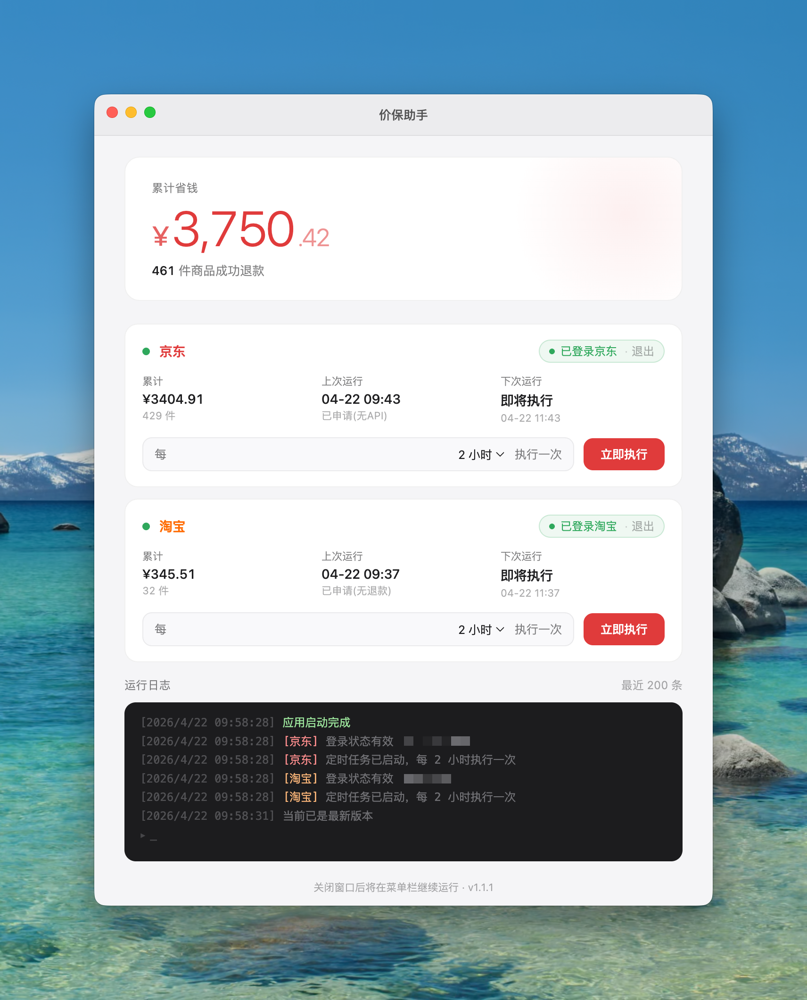

# 价保助手

一个 macOS 桌面小工具，自动给京东和淘宝订单申请价格保护。登录一次，之后定时在后台跑，有退款了发系统通知。

支持同一平台添加多个账号，帮全家人一起省钱。

## 功能

- 支持京东、淘宝双平台价格保护
- 同一平台可添加多个账号，独立管理
- 定时自动执行「一键价保」，间隔可配置（30 分钟 ~ 24 小时）
- 统计每次退款金额、累计省钱、成功件数
- 价保成功时发系统通知
- 从 GitHub Releases 自动检查并安装更新

## 安装

到 [Releases](https://github.com/cloud26/auto-price-guard/releases) 下载最新 `.dmg`，拖进 `/Applications`，首次打开后扫码登录即可。

> 💡 建议在平时经常登录京东/淘宝的设备上安装。陌生环境登录容易触发风控，验证码会非常难过。
